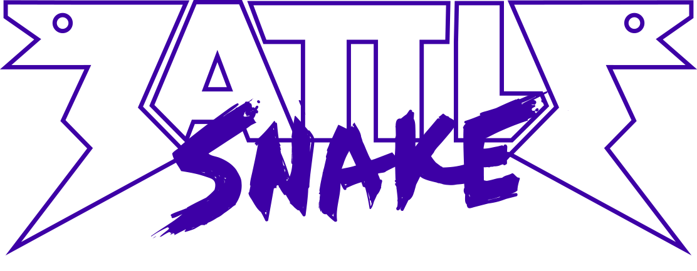

# Battlesnake FALL 2021 NodeJS AI


This is my entry for [Battlesnake](https://www.battlesnake.io) 2021 Fall competition, and is my first attempt at at generating one in NodeJS.

Forked from the great work of Tyrel Hiebert (https://github.com/tyrelh/battlesnake2020).
Who built his snakes from [NodeJS starter snake](https://github.com/battlesnakeio/starter-snake-node) provided by the [Battlesnake community](https://github.com/battlesnakeio/community).
https://github.com/tyrelh/battlesnake2020

## Running the snake locally
Follow the directions given on the [Battlesnake Docs](http://docs.battlesnake.io/zero-to-snake-linux.html) in the Zero to Snake section for your operating system. When you get to the point where it tells you to clone the starter snake, you can clone this snake instead if you wish.
```shell
git clone git://github.com/AJAX6255/BattleSnakeFall2021.git
```
You can also deploy this repo directly to Heroku by clicking this link. You will need a Heroku account to do this.

[](https://heroku.com/deploy)

## Resources mentioned by Tyrel
* [Battlesnake Homepage](https://www.battlesnake.io/)
* [Battlesnake 2019 API](http://docs.battlesnake.io/snake-api.html)
* [Battlesnake Docs](http://docs.battlesnake.io)
* [Battlesnake NodeJS Starter Snake](https://github.com/battlesnakeio/starter-snake-node)
* [My 2018 Python Entry](https://github.com/tyrelh/battlesnake2018)

## Changelog
* V0.1 - This is a Purple Snake named 'munchymike2' with Ski mask head and Weight tail. I have updated the JS dependencies that were falling behind.
* 
## TODO


_*The header image used in this readme is the property of [Battlesnake](https://www.battlesnake.io/)._
